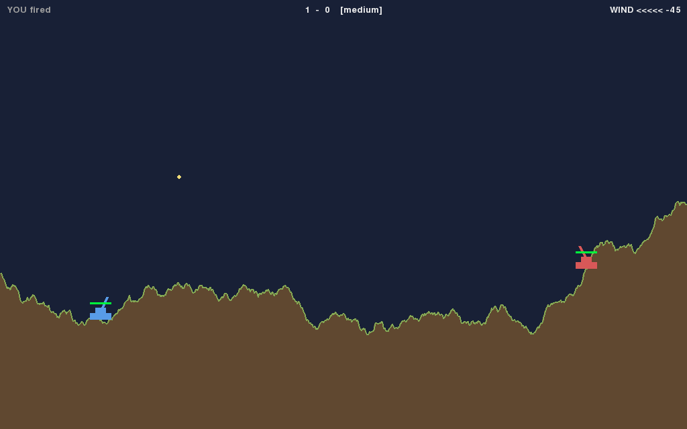

# tank

A 2D side-view turn-based artillery duel in Python + pygame. One human vs. one AI, best-of-five, destructible terrain, per-round wind, three difficulty levels, all SFX procedurally generated at startup (no audio assets).



## Run

```sh
micromamba create -p ./.venv -c conda-forge -y python=3.13 pygame numpy pytest
.venv/bin/python main.py
```

(Plain `python -m venv` + `pip install -r requirements.txt` works too.)

## Controls

| key | action |
|---|---|
| ← / → | aim angle |
| ↑ / ↓ | power |
| Space | fire |
| 1 / 2 / 3 | menu — Easy / Medium / Hard |
| R | next round (after a round) / back to menu (after a match) |
| ESC | quit |

## Tests

```sh
.venv/bin/pytest tests/ -q
```

51 tests cover terrain generation + craters, projectile physics, damage falloff, AI solver convergence, match-flow logic, and audio synthesis.

## Design

See [`specs/SPEC.md`](specs/SPEC.md) for the full design and the slice-by-slice build roadmap. The architecture diagram is in [`specs/tank_artillery_architecture_v2.svg`](specs/tank_artillery_architecture_v2.svg).

## License

MIT — see [LICENSE](LICENSE).
